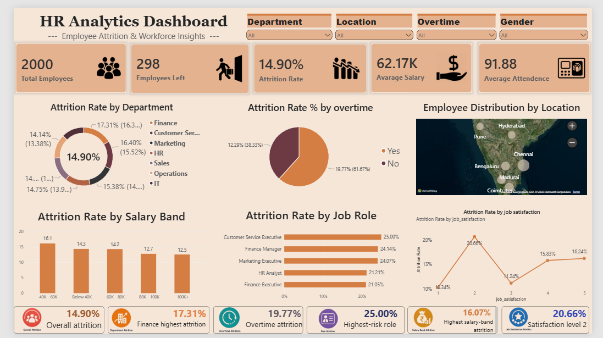

# HR Analytics - Employee Attrition Analysis

## 📊 Project Overview

This project focuses on analysing employee attrition and workforce data to identify patterns and understand areas associated with employee turnover.

I worked on the project using Excel, PostgreSQL, SQL and Power BI. The project covers the complete process from raw data cleaning to SQL analysis and finally creating an interactive HR dashboard.

---

## 🎯 Project Objectives

- Analyse overall employee attrition.
- Identify departments with higher attrition rates.
- Analyse attrition based on overtime and job satisfaction.
- Understand salary-band-wise attrition.
- Identify high-risk job roles.
- Build an interactive Power BI dashboard.
- Provide useful HR insights based on the analysis.

---

## 🛠️ Tools & Technologies

- **Microsoft Excel** – Data cleaning and initial analysis
- **PostgreSQL** – Database management
- **SQL** – Data analysis, CTEs and window functions
- **Power BI** – Dashboard and data visualization

---

## 🔄 Project Workflow

Raw Data  
↓  
Excel Data Cleaning  
↓  
Cleaned Dataset  
↓  
PostgreSQL Database  
↓  
SQL Analysis  
↓  
Advanced SQL Analysis  
↓  
Power BI Dashboard  
↓  
HR Insights & Recommendations

---

## 📁 Dataset

The dataset contains **2,000 employee records** with information such as:

- Employee ID
- Employee Name
- Gender
- Age
- Department
- Job Role
- Location
- Joining Date
- Experience
- Salary
- Performance Score
- Attendance
- Overtime
- Training Hours
- Job Satisfaction
- Work Hours
- Promotion History
- Attrition
- Exit Date

The dataset used in this project was created for analytical and portfolio purposes.

---

## 📈 Power BI Dashboard

The dashboard provides an interactive view of employee attrition and workforce characteristics.

### Dashboard includes:

- Total Employees
- Employees Left
- Overall Attrition Rate
- Average Salary
- Average Attendance
- Department-wise Attrition
- Overtime-wise Attrition
- Location-wise Employee Distribution
- Salary Band Attrition
- Job Role Attrition
- Job Satisfaction Attrition

---

## 🔍 Key Insights

### Overall Attrition

The overall employee attrition rate is **14.90%**, with **298 employees** leaving the organization.

### Department Attrition

**Finance** has the highest department-level attrition at **17.31%**, followed by Customer Service at **16.40%**.

### Overtime

Employees working overtime show an attrition rate of **19.77%**, compared with **12.29%** for employees without overtime.

This shows an observed association between overtime and higher attrition in this dataset.

### Job Role

**Customer Service Executive** has the highest observed job-role attrition at **25.00%**.

### Salary Band

The **₹40K–₹60K** salary band has the highest attrition rate at **16.07%**.

### Job Satisfaction

Employees with **job satisfaction level 2** have the highest observed attrition rate at **20.66%**.

---

## 💡 HR Recommendations

Based on the analysis, the following areas could be considered by HR:

- Review workload and overtime practices.
- Investigate employee concerns in high-attrition departments.
- Focus retention efforts on high-risk job roles.
- Review compensation and career growth opportunities.
- Conduct regular employee satisfaction surveys.
- Develop targeted retention strategies for employees showing higher attrition risk.

These recommendations are based on observed patterns in the dataset and do not establish direct causation.

---

## 🧠 SQL Analysis

The SQL analysis includes:

- Employee and department analysis
- Attrition rate calculations
- Salary analysis
- Overtime analysis
- Job satisfaction analysis
- CTE-based analysis
- Company benchmark comparisons
- Risk classification
- Job-role ranking
- Window functions
- `RANK()`
- `LAG()`
- `ROW_NUMBER()`
- Running averages
- Department-level role ranking
- High-risk role identification
- SQL Views

---

## 📂 Project Files

| File | Description |
|---|---|
| `HR_Analytics_Raw_Data.csv` | Original raw dataset |
| `HR_Analytics_Raw_Data_excel.xlsx` | Raw dataset in Excel |
| `HR_Analytics_cleaned_data.csv` | Cleaned dataset |
| `HR_Analytics_cleaned_data_excel.xlsx` | Excel analysis and cleaning |
| `HR_Analytics_SQL_Analysis.sql` | Complete SQL analysis |
| `HR_Analytics_Dashboard.pbix` | Power BI dashboard |
| `HR_Analytics_Dashboard.png` | Dashboard preview |
| `HR_Analytics_Project_Report.pdf` | Complete project report |

---

## 📌 Conclusion

This project helped me understand how data can be used to analyse employee attrition and support HR decision-making.

Through this project, I gained practical experience in data cleaning, Excel analysis, PostgreSQL, SQL querying, advanced SQL techniques and Power BI dashboard development.

The project also helped me understand how to convert raw employee data into meaningful business insights.

---

## 👨‍💻 Skills Demonstrated

**Excel | PostgreSQL | SQL | Power BI | Data Cleaning | Data Analysis | Data Visualization | HR Analytics | Business Insights**
